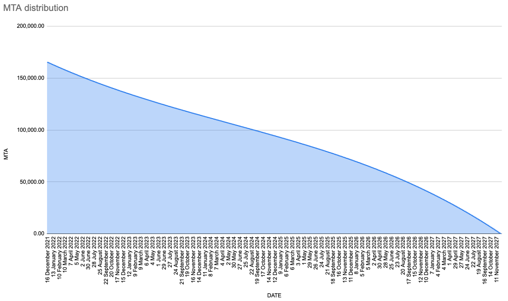
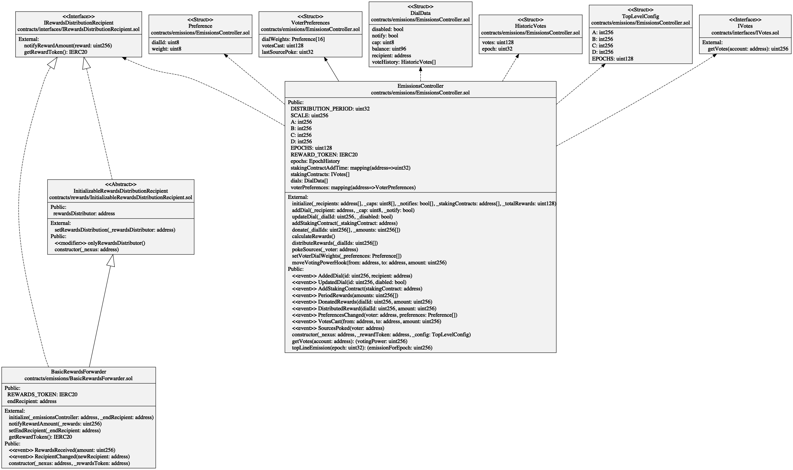
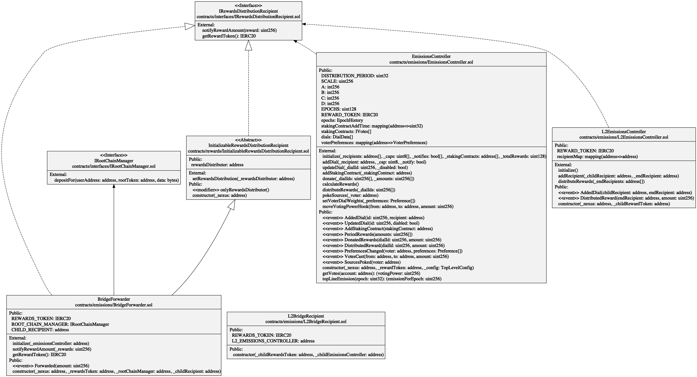
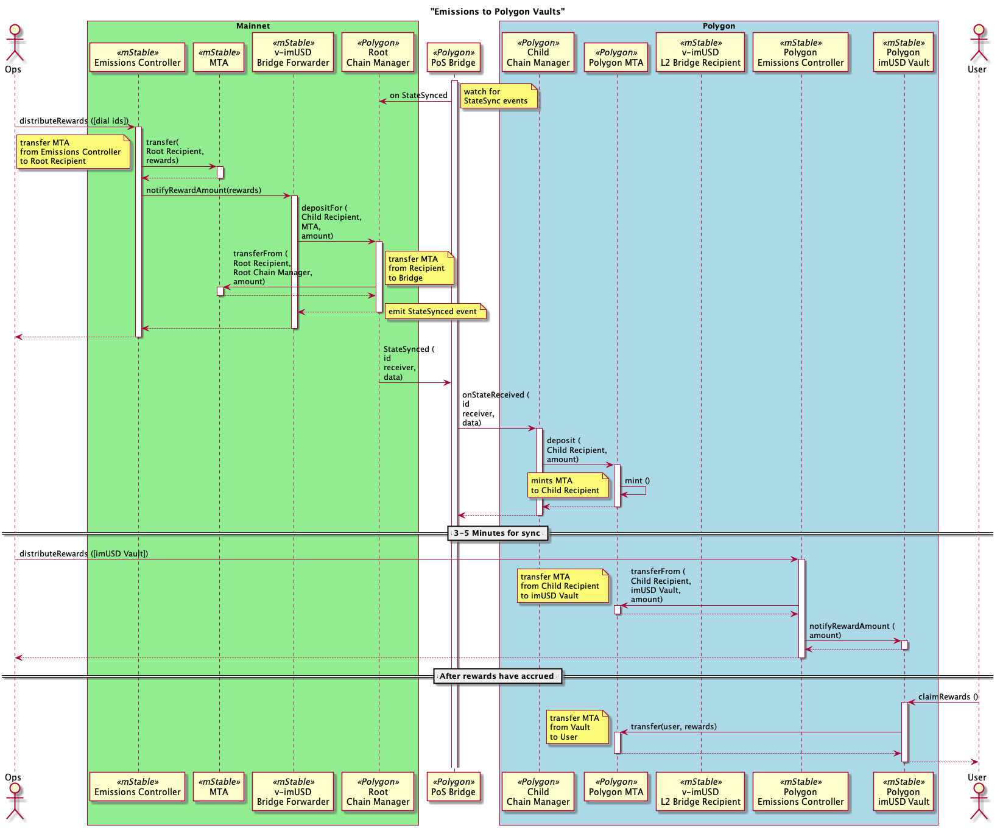
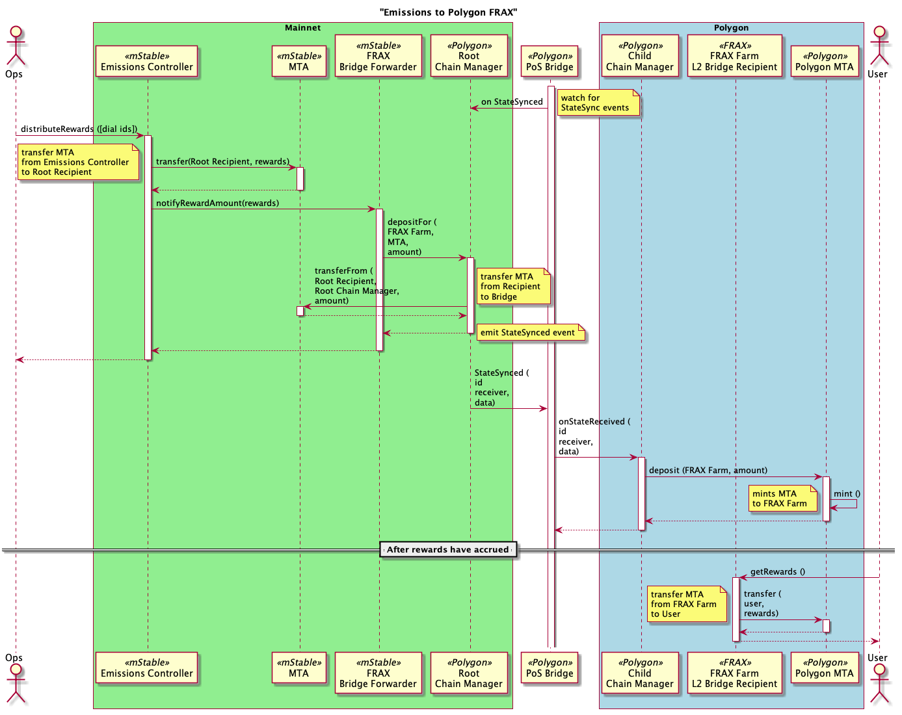
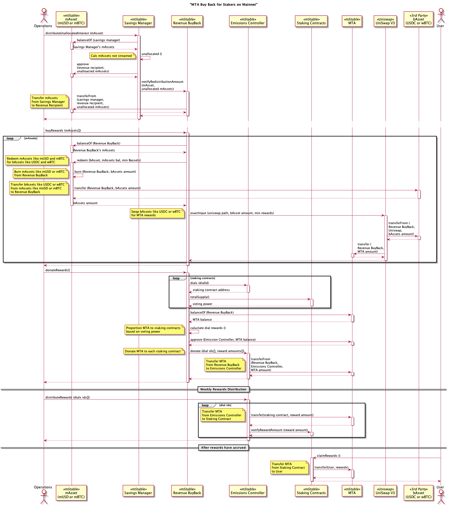
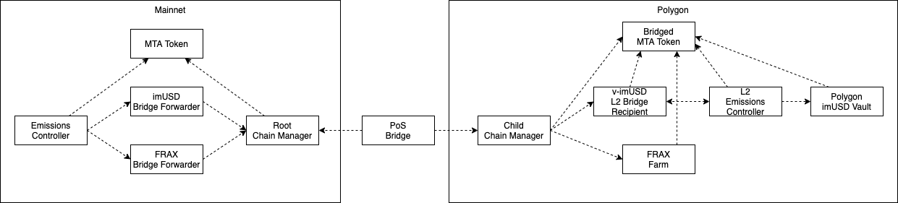

# Emissions Controller

The Emissions Controller is an on-chain governance platform that allows MTA token holders, or their delegated account, to decide where MTA rewards are directed each week. This is similar to [Curve’s GaugeController](https://dao.curve.fi/gaugeweight).

## Design

### Dials

Dials determine the amount of the MTA rewards that are sent to a dial’s recipient contract.

A dial recipient can be any contract that can either receive MTA tokens or can be notified of the amount of received rewards so the contract can immediately action.

Types of dial recipients include

-   MTA staking contracts like MTA Staking Token and mBPT Staking Token
-   mStable vaults that stake interest-earning mAssets like imUSD and imBTC
-   mStable vaults that stake feeder pool liquidity provider tokens like fPmUSD/GUSD, fPmUSD/alUSD and fPmBTC/HBTC
-   Third-party contracts like Visor Finance
-   Polygon
    -   mStable 's imUSD Vault on Polygon
    -   FRAX’s farming contract for staked fPmUSD/FRAX tokens
    -   An account that disperses MTA to an off-chain generated list of Balancer MTA/WMATIC/WETH Pool liquidity providers.

Dials recipients can do anything with their received MTA rewards. Some possibilities are:

-   mStable Vault for liquidity provider tokens. eg Curve or Balancer
-   A multisig wallet that allows signers to distribute at their discretion
-   An Olympus DAO bond that purchases liquidity for the protocol at a discounted MTA price.
-   A contract that sends the MTA rewards back to the emissions controller
-   A contract that burns MTA rewards so they are removed from the total supply

### Emissions Schedule

The 30m MTA rewards over 6 years will use a polynomial to calculate the weekly rewards. This will quickly reduce the amount of MTA being distributed each week, slow down the reduction in the middle and then accelerate the reduction of distributed rewards at the end.

The polynomial formula

```
f(x)=A*(x/div)^3+B*(x/div)^2+C*(x/div)+D
A 1.66E+17
B 1.68E+17
C -1.68E+17
D 1.66E+17
div 312000000
```



### Voting Power

Votes for dials come from the voting power in the recently deployed Staking V2 contracts. Voting power can be acquired by staking MTA or by another staker delegating their voting power to another account. If a user has delegated their voting power but now wants their voting power back they can remove the delegation of voting power.

Initially, all the existing contracts that receive MTA rewards will be open to voting. After a two week voting period, the old MTA reward distribution will be stopped and the new MTA distribution based on staker votes will begin.

### Weighting votes across dials

Accounts with voting power can proportion their voting power across the configured dials. This can be 100% on just one dial. Or could be a little to each dial. The more dials that are voted on the more gas is required when changing voting power in the staking contracts. eg staking, withdrawing or changing delegation.

Once the voting weights across the dials are set, this will be used for each weekly distribution until the weights are changed. That is, voters don’t need to spend gas every week if their weighting of voting power across the dials remains the same every week.

The emissions controller will maintain the weighted votes for each dial. If a voter’s voting power changes, then the dial weight will be updated. This can be from staking, withdrawing or changes to delegation.

To prevent voters from just giving all the MTA to themselves, each staking contract will receive maximum of 10% of the MTA distributions each week. There are currently two staking contracts so that’s a maximum of 20% of the MTA rewards going to the stakers.

To generate more value for the MTA holders, the Protocol revenue will be used to buy MTA and distribute to stakers. This incentivises the voters to maximise the protocols revenues.

There is no cap on the amount of MTA a dial that is not a staking contract can receive. So all the voting power could be put on just one dial. This is unlikely to happen as it would require over 200 stakers to collude.

### Donations

The emissions controller will allow anyone to donate MTA rewards to a dial that is in addition to the weekly emissions schedule. These additional MTA rewards will be included in the weekly distribution. This can be used by mStable or third parties to incentivize dials.

### Polygon Integration

Polygon’s [Proof of Stake (PoS) Bridge](https://docs.polygon.technology/docs/develop/ethereum-polygon/pos/getting-started) will be used by the Emissions Controller to send MTA to the existing [Polygon MTA](https://polygonscan.com/token/0xF501dd45a1198C2E1b5aEF5314A68B9006D842E0) token on Polygon. This will be done indirectly using a dial recipient contract that interfaces with the PoS Bridge.

MTA rewards can be sent directly to the dial contract on Polygon. eg FRAX. Or MTA rewards can be sent via the L2 Emissions Controller which will notify the recipient contract that the rewards have been transferred. eg the imUSD Vault on Polygon.

Voting can not be done on Polygon. All voting of dials is done on Ethereum mainnet.

### Weekly Distribution

The weekly distribution of the MTA rewards will be done in two transactions

1. The amount of MTA rewards for each dial is calculated

-   calculate the amount of MTA rewards to be distributed for the week.
-   calculate the total weight votes across all dials that have not been disabled.
-   calculate the MTA rewards for each dial that has not been disabled

2. Transfer MTA rewards to specified dials and optionally notify
   This can be broken down into a smaller number of transactions depending on gas usage.

-   Transfers the previously calculated MTA rewards plus any donated MTA to the specified dial recipient contracts.
-   If the dial is configured for notifications, the dial is notified of the distributed MTA amount so it can process the received MTA.

The weekly distributions can be run after Thursday, 00:00am UTC time.

It’s possible the MTA rewards can be calculated but not transferred. Each new calculated reward will just be added to any undistributed MTA rewards so when the distribution is eventually run all MTA rewards will be distributed.

## Contracts

### Main Emissions Controller contract

-   [EmissionsController](./EmissionsController.sol)
-   [BasicRewardsForwarder](./BasicRewardsForwarder.sol)
-   [RevenueBuyBack](../buy-and-make/RevenueBuyBack.sol)



### Polygon Integration Contracts

-   [L2EmissionsController](./L2BridgeRecipient.sol)
-   [L2BridgeRecipient](./L2BridgeRecipient.sol)
-   [BridgeForwarder](./BridgeForwarder.sol)



## Processes

### Weekly Rewards Distribution


### Distribution to imUSD Vault on Polygon



### Distribution to FRAX Farm on Polygon



### Distribution to Balancer Pool liquidity providers on Polygon


### MTA Buy Back for Stakers



## Polygon Integration

Polygon's [Proof of Stake (PoS) Bridge](https://docs.polygon.technology/docs/develop/ethereum-polygon/pos/getting-started) will be used by the Emissions Controller to send MTA to the existing Polygon MTA token on Polygon. This will be done indirectly using a dial recipient contract that interfaces with the PoS Bridge.

### Contract dependencies



**Bridge Forwarder** - are separate Mainnet contracts for each L2 recipient contracts on Polygon. Initially, there would be a contract for the Polygon imUSD Vault and FRAX Vault.

The Bridge Forwarder contracts will receive MTA rewards from the Emissions Controller who call's the `notifyRewardsAmount` function. This then calls the `depositFor` function on the PoS Bridge. See the above sequence diagrams for another view of this process.

**Root Chain Manager** - is an existing Polygon contract that is used to bridge tokens between Mainnet and Polygon. [https://etherscan.io/address/0xA0c68C638235ee32657e8f720a23ceC1bFc77C77](https://etherscan.io/address/0xA0c68C638235ee32657e8f720a23ceC1bFc77C77)

`depositFor(userAddress, rootToken, abiEncodedAmount)`

For sending to the Polygon imUSD Vault:

-   `userAddress` will be the L2 imUSD Recipient address
-   `rootToken` is the Mainnet MTA address
-   `abiEncodedAmount` is bytes of the ABI encoded amount of MTA rewards.

**PoS Bridge** - is Polygon's of-chain process that listens for `StateSync` events from the RootChildManager and relays them to the Child Chain Manager on Polygon by calling the `onStateReceived` function. Note the call to `onStateReceived` is a system transaction so is not visible in a blockchain explorer.

**Child Chain Manager** - is a Polygon contract that is responsible for depositing bridged tokens into the bridged token on Polygon. [ChildChainManager](https://polygonscan.com/address/0xA6FA4fB5f76172d178d61B04b0ecd319C5d1C0aa)

**Bridged MTA Token** - is an existing Polygon contract that was deployed when MTA was first bridged to Polygon. [Polygon MTA](https://polygonscan.com/address/0xF501dd45a1198C2E1b5aEF5314A68B9006D842E0)

The bridged MTA Token grants the Child Chain Manager the `DEPOSITOR` role so it can call the `deposit` function which mints bridged MTA for MTA that has been locked in the Root Chain Manager on Mainnet.

**L2 Bridge Recipients** - Are contracts that receive bridged MTA tokens from the PoS Bridge. Separate contracts are used so the L2 Emissions Controller knows the amounts to be distributed to the final reward recipient contracts.

**L2 Emission Controller** - is used transfer all bridged MTA Tokens from the L2 Bridge Recipients to the end contracts that implement the `IRewardsDistributionRecipient` interface. For example, the Polygon imUSD Vault. After the tokens are transferred, the `notifyRewardsAmount` is called on the recipient contract so it can process the rewards.

The L2 Bridge Recipients need to have approved the L2 Emissions Controller to transfer the Bridged MTA tokens.
